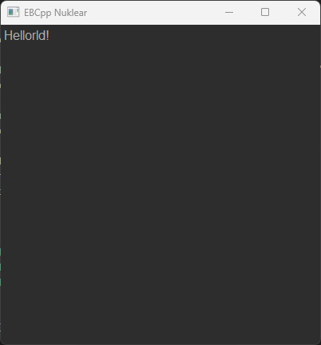

# EBCppNuklear

EBCppNuklear is a extension to EBCpp using teh library by [Immediate-Mode-UI/Nuklear](https://github.com/Immediate-Mode-UI/Nuklear) to create a GUI interface.

Windows ONLY!

## Minimal Example

This example shows how to create a window with a label.

```C++
// Allways inclue Nuklear Implemtation first
#include <EBNuklearImplementation.hpp>

#include <EBApplication.hpp>
#include <EBNuklear.hpp>

class MinimalExample : public EBCpp::EBObject<MinimalExample>
{
    public:
        MinimalExample()
        {
            window = EBCreate<EBCpp::Nuklear::EBNuklearWindow>(400, 400, "EBCpp Nuklear");
            window->setFont("Arial", 9);

            row = EBCreate<EBCpp::Nuklear::EBNuklearRow>(30, 1);
            window->setCentralWidget(row);

            label = EBCreate<EBCpp::Nuklear::EBNuklearLabel>();
            label->setText("Hellorld!");
            row->addWidget(label);
        }

    private:
        EBPtr<EBCpp::Nuklear::EBNuklearWindow> window;
        EBPtr<EBCpp::Nuklear::EBNuklearRow> row;
        EBPtr<EBCpp::Nuklear::EBNuklearLabel> label;
};

EB_APPLICATION(MinimalExample);
```

Example produces this window with the "Hellorld!" label.



More examples can be found in the example directory.
